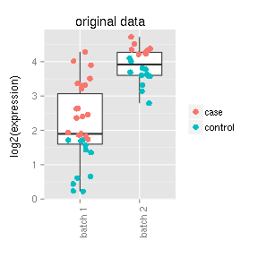
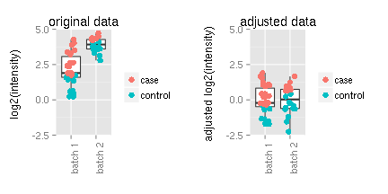

Illustrate usage of child documents in knitr
=======================================================
### Sarah Gerster (sarah.gerster@isb-sib.ch) and Frédéric Schütz (frederic.schutz@isb-sib.ch)
### Bioinformatics Core Facility, SIB Swiss Institute of Bioinformatics, Lausanne, Switzerland
### March 20, 2014
<!--% Thu Apr  3 22:20:07 2014-->

<!--
File : markdown_template_child-docs.Rmd
Desc : illustrate usage of child documents in knitr 
Auth : Sarah Gerster
Date : 20 Mar 2014

THE SOURCE OF THIS DOCUMENT IS *.Rmd
DO NOT EDIT THE *.md, *.html, *.doc, *.pdf, *.R, ... FILES !!!
-->

 
<!-- Setting up R -->


# What are child documents?
Child documents are sub-files written in the same format (in our case markdown) as the main document, which should be included in the main document when compiling the report. Refer to http://yihui.name/knitr/demo/child/ for additional information.

In this example, we want to keep this main document brief. It should only contain this introduction, the skeleton of the rest of the file (including the child documents), the information about the R session and an appendix. Please explore all input files to see how calls to child documents can be nested.

<!-- include child document in which data is generated -->

<!--
File : child-datagen.Rmd
Desc : a child document simulating some data 
Auth : Sarah Gerster
Date : 20 Mar 2014

THE SOURCE OF THIS DOCUMENT IS *.Rmd
DO NOT EDIT THE *.md, *.html, *.doc, *.pdf, *.R, ... FILES !!!
-->

# Generating some data 
We will simulate some meaningless data to have some values to plot and
represent in tables. The code to simulate the data is shown below:


```r
set.seed(42)  # for reproducibility
## simulated values of two genes for samples from different batches
gene1_b1 <- sort(abs(rnorm(30, mean = 2, sd = 1)))
gene1_b1_groups <- rep(c("control", "case"), times = c(11, 19))
gene1_b2 <- sort(abs(rnorm(20, mean = 4, sd = 0.5)))
gene1_b2_groups <- rep(c("control", "case"), times = c(12, 8))

## put the simulated data in a data frame
orig_df <- data.frame(by = as.factor(rep(c("batch 1", "batch 2"), times = c(30, 
    20))), vals = c(gene1_b1, gene1_b2), cat = as.factor(c(gene1_b1_groups, 
    gene1_b2_groups)))
```


<!-- include child document in which data is plotted -->

<!--
File : child-dataplot.Rmd
Desc : a child document to visualize the data
Auth : Sarah Gerster
Date : 20 Mar 2014

THE SOURCE OF THIS DOCUMENT IS *.Rmd
DO NOT EDIT THE *.md, *.html, *.doc, *.pdf, *.R, ... FILES !!!
-->

# Plotting the data 
Assume the data actually corresponds to measured intensities for a specific gene extracted from a larger gene expression data set. The samples were processed in two batches. We call a customized plotting function to get a first idea of what the data look like (code not shown in the report).


```r
my_R_function(df = orig_df, y_lab = "log2(expression)", title = "original data")
```

 


There seems to be a batch effect which we would like to remove.


<!-- include child document in which data is plotted -->

<!--
File : child-batchrem.Rmd
Desc : a child document to remove the batch effect and plot resulting data
Auth : Sarah Gerster
Date : 20 Mar 2014

THE SOURCE OF THIS DOCUMENT IS *.Rmd
DO NOT EDIT THE *.md, *.html, *.doc, *.pdf, *.R, ... FILES !!!
-->

## Batch effect removal with a simple z-transform:

```r
norm_df <- data.frame(by = as.factor(rep(c("batch 1", "batch 2"), times = c(30, 
    20))), vals = c(scale(gene1_b1), scale(gene1_b2)), cat = as.factor(c(gene1_b1_groups, 
    gene1_b2_groups)))
```


To see the effect of our batch effect removal step, we want to plot
both, the original and the corrected data next to each other (code not
shown in the report):

```r
## plot original data
plot1 <- my_R_function(df = orig_df, y_lab = "log2(intensity)", y_lim = c(-2.5, 
    5), title = "original data")
## plot modified data
plot2 <- my_R_function(df = norm_df, y_lab = "adjusted log2(intensity)", y_lim = c(-2.5, 
    5), title = "adjusted data")
grid.arrange(plot1, plot2, ncol = 2)
```

 


# Information about the R session
Don't forget to include information about the R session
(version of R and used packages) in which the current report was
generated:


```
## R version 3.0.2 (2013-09-25)
## Platform: x86_64-pc-linux-gnu (64-bit)
## 
## attached base packages:
## [1] grid      stats     graphics  grDevices utils     datasets  methods  
## [8] base     
## 
## other attached packages:
## [1] xtable_1.7-1    gridExtra_0.9.1 ggplot2_0.9.3.1 knitr_1.5      
## 
## loaded via a namespace (and not attached):
##  [1] MASS_7.3-29        RColorBrewer_1.0-5 colorspace_1.2-4  
##  [4] dichromat_2.0-0    digest_0.6.3       evaluate_0.5.1    
##  [7] formatR_0.10       gtable_0.1.2       labeling_0.2      
## [10] munsell_0.4.2      plyr_1.8           proto_0.3-10      
## [13] reshape2_1.2.2     scales_0.2.3       stringr_0.6.2     
## [16] tools_3.0.2
```


# APPENDIX: How to generate a .docx file from this R markdown document?
Knit the .Rmd file to produce an .md file. Then, in a shell, run

        $ pandoc markdown_template_child-docs.md -o report-via-pandoc.docx
        
By the way, you could also use pandoc to generate a standalone HTML file with numbered sections:

        $ pandoc -Ns markdown_template_child-docs.md -o report-via-pandoc.html

If you want some sections to be unnumbered, for example the title, authors, affilitation and date in this document, just add ` {-}` at the end of the corresponding lines.

If you are interested in working with markdown, we strongly encourage you to convert the files "manually" from .md to your final format via pandoc. It is much more flexible than the in-built tools in R.
